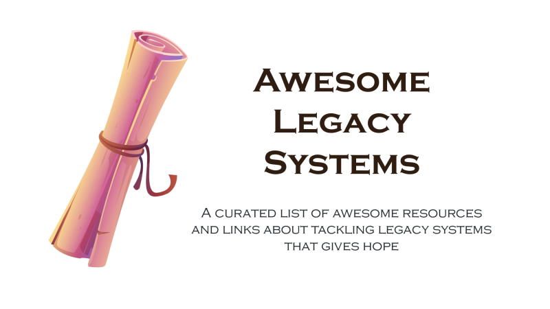

# Awesome Legacy Systems 

> A curated list of awesome resources and links about tackling legacy systems that gives hope.

Hi! My name is [Markus Harrer](https://github.com/feststelltaste). I created this repository to share a set of resources and links that I found valuable and inspiring while working with legacy systems. I hope that you'll like it, too! If you want to add something, feel free to [contribute your ideas](contributing.md).

_Current state in February 2022: This is the initial draft / work-in-progress of a new awesome list. Currently, there are some descriptions and the reasons of "why you should take a look at something" missing. But I find that it is already worth taking a look at it!._

Image source: <a href='https://www.freepik.com/vectors/ancient-scroll'>Ancient scroll vector created by upklyak - www.freepik.com</a>

**What are legacy systems and why should I care?**

Legacy Systems are systems that you might be too afraid of to change. But they are necessary because they make all the money for your company. Thus, developers often have to maintain these older systems whether they want or not.

Legacy systems have their own fascinations and challenges that can be much more interesting than just gluing together some frameworks in a green-field project. But the lack of knowledge about how to tackle legacy systems is a big problem. Most developers just learn how to create new systems initially and not how to maintain existing ones or even evolve those systems. This list tries to close these gaps.

## Contents

- [Books](#books)
- [Blogs](#blogs)
- [Microsites](#microsites)
- [Podcasts](#podcasts)
- [Talks](#talks)
- [Conferences](#conferences)
- [Courses](#courses)
- [Lists of Tools](#lists-of-tools)
- [Other languages](#other-languages)
- [Related Awesome Lists](#related-awesome-lists)

_The resources are ordered alphabetically the first author's surname for books and articles or the name of the resource for all the other resources)_

## Books

- [Marianne Bellotti: Kill It with Fire (2021)](https://www.penguinrandomhouse.com/books/667571/kill-it-with-fire-by-marianne-bellotti/) - a book that gives a fresh look at working with legacy systems. It contains plenty of tips to assess architectures and provides guidance as well as tips for keeping modernization plans on track.
- [David Scott Bernstein: Beyond Legacy Code (2015)](https://pragprog.com/titles/dblegacy/beyond-legacy-code/) - a book focussing on the agile way of improving legacy code. It includes plenty of material regarding improving processes and tips for better collaboration, too. If you want to see how agile methodology fits into the area of legacy system modernization, this book is for you.
- [Serge Demeyer, Stéphane Ducasse and Oscar Nierstrasz: Object-Oriented Reengineering Patterns (2003)](http://scg.unibe.ch/download/oorp/) - a book with plenty of patterns for tackling the challenges with legacy systems explained in great detail.
- [Michael Feathers: Working Effectively with Legacy Code (2004)](https://learning.oreilly.com/library/view/working-effectively-with/0131177052/) - the classic book that gives you hope for your old system with many small recipes for improving your old codebase.

## Blogs

- [Philippe Bourgau's XP Coaching Blog: Refactoring Code and Orgs to a Sustainable Pace](https://philippe.bourgau.net/)
- [Nicolas Carlo: Understand Legacy Code: Change Messy Software Without Breaking It](https://understandlegacycode.com)
- [Peter Morlion: Helping companies tackle legacy code, and other software development musings](https://www.petermorlion.com/)

**Blog Posts**

- [Markus Harrer: 17 actions you can take to move your legacy system forward](https://twitter.com/feststelltaste/status/1451148235121299461) - a Twitter thread that lists which options you have when you want to do something with your legacy system.
- [Nick Tune: Legacy Architecture Modernisation With Strategic Domain-Driven Design (2020)](https://medium.com/nick-tune-tech-strategy-blog/legacy-architecture-modernisation-with-strategic-domain-driven-design-3e7c05bb383f) - a braindump that brings several methods for different legacy system modernization tasks together into one framework.

## Microsites

- [Architecture Improvement Method aim42](https://aim42.github.io/) - a collection of practices and patterns to support software evolution, modernization, maintenance, migration, and improvement of software systems. (transparency hint: the maintainer is one of the authors of this list).
- [Patterns of Legacy Displacement: Effective modernization of legacy software systems](https://martinfowler.com/articles/patterns-legacy-displacement/) - a collection of procedures, patterns and experience reports around the piecemeal replacement of legacy systems.

## Podcasts

- [legacycode.rocks](https://www.legacycode.rocks/) - a podcast (and community) created by Andrea Goulet and M. Scott Ford from Corgibyte about the world of modernizing existing software applications.

**Podcast Episodes**
- [Grady Booch @ IEEE Software's On Architecture Podcast: Nine Things You Can Do with Old Software (2008)](https://www.computer.org/publications/tech-news/on-architecture/nine-things-you-can-do-with-old-software) - what you "can do intentionally with legacy code, from abandonment to evolution and many things in between" (taken from the podcast episode's description).
- [Dave Thomas @ SE-Radio Episode 242: Innovating Legacy Systems](https://www.se-radio.net/2015/11/se-radio-episode-242-dave-thomas-on-innovating-legacy-systems/)

## Talks

- [Dylan Beattie @ NDC2019: Ctrl-Alt-Del: Learning to Love Legacy Code ](https://www.youtube.com/watch?v=wPjHuvulivM&t=635s)
- [Marianne Bellotti @ MLH Fellowship 2020: Future Proofing Systems](https://www.youtube.com/watch?v=_ICzo5r-7vY)
- [Colin Breck @ QCon2017: Using Quality Views to Tackle Tech Debt @Tesla](https://www.infoq.com/presentations/quality-views-technical-debt/) - Colin Breck created a view of software qualities (or the absence from it) for bigger software systems to create more awareness for fixing technical debt.
- [Eric Evans @ Øredev 2015: Strategic Design](https://www.feststelltaste.de/should-i-rewrite-or-reengineer-a-software-system/) - Eric Evans shares his view towards a more business-driven approach to rewrites (links to a blog post because video is not public yet).
- [Michael Feathers @ QCon 2017: Strategic Code Deletion](https://www.infoq.com/presentations/remove-unneeded-code/) - "Michael Feathers describes techniques that generate more certainty around assessments of feature liveness, and strategies that can be used to remove code that does not have high value" (taken from the description).
- [Andrea Goulet @ DC FULL STACK 2017: Putting the Right Developers on the Right Projects](https://www.youtube.com/watch?v=nVI2zfzKYqM)
- [Gregor Hohpe @ AWS re:Invent 2021: The architect elevator: Connecting IT and the boardroom](https://www.youtube.com/watch?v=nNbnXTl2VFQ) - a talk about connecting the different needs of different stakeholders of different layers of an organization. Great insights into how to motivate and translate modernization ideas from the engine room to something people in the penthouse can understand and work with.
- [Sabrina Leandro @ DDD Europe 2019: How to rewrite, a bit at a time](https://www.youtube.com/watch?v=AmicHHpogEg)
- [Maude Lemaire @ LeadDevAustin 2018: How to get away with refactoring](https://www.youtube.com/watch?v=34tLTZgvOxM)
- [Sandro Mancuso @ Trendyol Tech Meetup 2021: Software Modernization: A strategic approach](https://www.youtube.com/watch?v=HbbLpYSeAgk)
- [Sam Newman @ NDC Oslo 2019: Monolith Decomposition Patterns](https://www.youtube.com/watch?v=64w1zbpHGTg)
- [Gernot Starke @ GOTO 2016: Improving Your Software ](https://www.youtube.com/watch?v=B8oJwY2Fq3I)
- [Jesse Toth @ RubyConf 2014: Easy rewrites with ruby and science!](https://www.youtube.com/watch?v=kgDqUHWVw4A) - a story told about rewriting the permission system at GitHub, a big, mission-critical part of github.com.

## Conferences

- [The Legacy of SoCraTes](https://www.youtube.com/channel/UC0M37QolwmwobAY4Bt8Tszg) - an irregular online conference where speakers share their insights on how to approach legacy systems in a successful way. Plenty of talks from various directions make this resource valuable for people tackling legacy systems.

## Courses

- [paid] [M. Scott Ford: Agile Software Development - Dealing with Legacy Code and Technical Debt](https://www.linkedin.com/learning/agile-software-development-dealing-with-legacy-code-and-technical-debt)
- [paid] [Markus Harrer: Evolution and Improvement of Software Architectures](https://www.skillsmatter.com/workshops/863-evolution-and-improvement-of-software-architectures-with-markus-harrer) - a 3 full-day workshop that covers the analysis of the existing software architecture, the identification of solution approaches, and the implementation of improvements _(transparency hint: the trainer is one of the authors of this list)_.

## Lists of Tools

There are plenty of tools out there that can help you with your legacy systems. This section lists existing lists so that you can find your tool that fit to your specific needs:

- [Analysis-Tools.dev](https://analysis-tools.dev/) - static analysis tools for many programming languages, build tools, config files and more.
- [Awesome Open Source - Profilers](https://awesomeopensource.com/projects/profiler) - tools for in-depth runtime analysis.
- [OpenAPM](https://openapm.io/landscape) - lists various Application Performance Management tools that can help you to find performance problems.

## Other Languages

This list focusses on contant in English. But there is also content out there in other languages.

- [German] [Großartige Bestandssysteme](readme_de.md) - eine kuratierte Liste mit großartigen Ressourcen und Links zum Umgang mit Altsystemen, die Hoffnung macht.

## Related Awesome Lists

This section lists other awesome lists in the area of legacy systems.

- [Awesome Legacy Code](https://github.com/legacycoderocks/awesome-legacy-code) - a curated list of legacy systems with publicly available source code.
- [Awesome Modernization](https://github.com/modernizing/awesome-modernization) - awesome legacy system modernization tools. _(partly in Chinese)_
- [Awesome Software Analytics](https://github.com/feststelltaste/awesome-software-analytics) - a curated list of awesome resources and links about Software Analytics &ndash; a discipline that tries to analyze software data to get ideas about improving legacy systems.
- [Awesome Technical Debt](https://github.com/labcodes/awesome-technical-debt) - a curated list of Technical Debt talks, articles, and books. _(there might be some overlaps with this list)_

## Contribute

Did you like this list? Contributions are very welcome! Read the [contribution guidelines](contributing.md) first and add your ideas!
